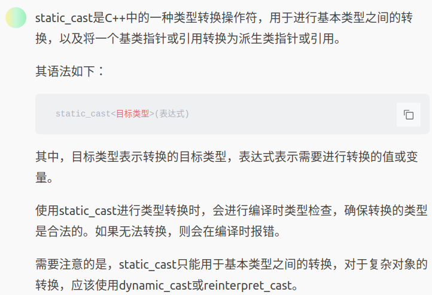
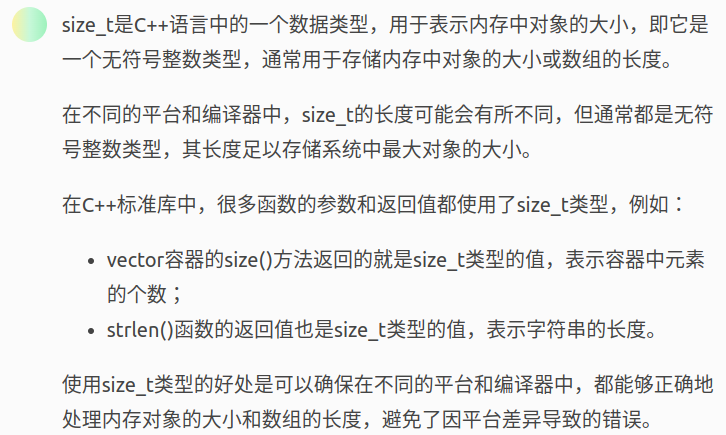
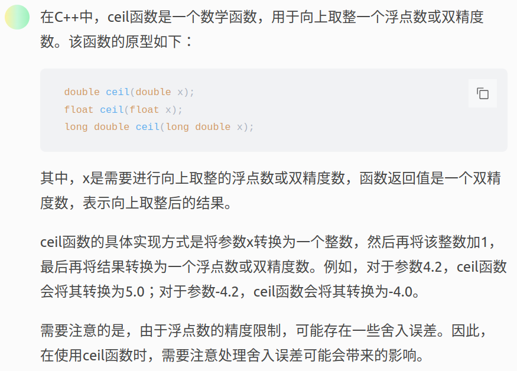
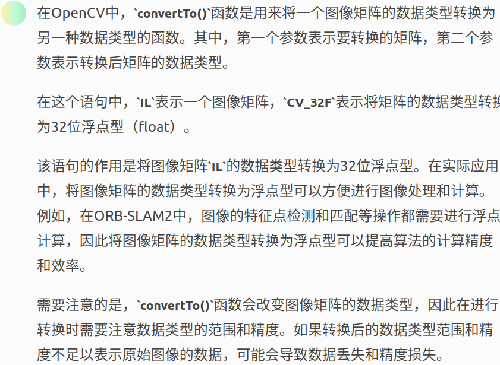

##### <1> 

vector:单端数组 可以用sort（可以遍历）

deque:双端数组（可以遍历）

stack:栈（入栈和出栈，**不允许遍历**）

queue:队列容器（先进先出，两个出口，允许一端新增元素，从另一端移除元素）

list:链表（双向迭代器）


##### <2>内建函数对象：

1）算术仿函数

2）关系仿函数

3）逻辑仿函数


##### <3>函数后面加const：

成员函数不改变类的数据成员，也就是说这些函数是”只读“函数，而有一些函数要修改类数据成员的值，因此加上const增强了代码的可读性。


##### <4>C++中的__builtin_popcount函数(注意是两个_ 写成的__)

该函数为C++自带的函数库，内部实现是用查表实现的

**作用：用于统计数字在二进制下的“1”的个数**


##### <5>异或运算符(^)

规则：相同为0，不同为1


##### <6>三目运算符

语法：条件1 ? 表达式1 : 表达式2

条件为真执行表达式1，否则为表达式2

##### (7)       
size_t:“整型”类型，用来记录一个大小，全称为size type，就是说“一种用来记录大小的数据类型”。     
(2)     
reset:将数组的内部指针指向第一个元素，并返回这个元素的值。    

##### (8)       
static_cast:转换运算符      
xx_cast(data)     

##### (9)hash     
unordered_map:存储<key,value>键值对的关联式容器，允许通过key快速的索引到与其对应的value       

##### (10)
Ptr:看成opencv中的智能指针        

##### (11)override关键字
作用：如果派生类在虚函数声明时使用了override描述符，那么该函数必须重写其基类中的同名函数，    
否则代码将无法通过编译。   
增加了编译器检查的安全性。   
  
##### (12)   
eg: inline float GetPixelValue() {}     
inline关键字，可以用于定义内联函数，像普通函数一样被调用，但在调用时并不通过函数的调用机制，  
而是直接在调用点展开，这项可以大大减少由函数调用带来的开销，从而提高程序的运行效率。  

##### (13) Floor:向下取整  
isNaN():判断参数是否”不是数值”；isNaN()在接收到一个值之后，会尝试将这个值转换为数值，如果能成功转换则返回false，否则返回true；
cv::Scalar(v1, v2, v3, v4)的这四个参数就依次是BGRA，即蓝、绿、红和透明度;

##### (14)
atan2:C 语言里 double atan2(double y,double x) 返回的是原点至点(x,y)的方位角，即与 x 轴的夹角。返回值的单位为弧度，取值范围为（-π, π]。结果为正表示从 X 轴逆时针旋转的角度，结果为负表示从 X 轴顺时针旋转的角度。

// orbslam2 C++汇总   

1. namespace
命名空间，比如区分相同函数名在不同空间下的使用

2. static_cast 类型转换操作符


3. size_t  
  

4. 二分法查找  
```
int mid = (left + right) / 2;
int mid = ((right - left) >> 1) + left;  // 消耗内存更小，然而实际在lc上测试怎么发现第一种方法消耗内存更小 ...  
```

5. static关键字  
静态局部变量、静态全局变量、静态成员变量，静态成员函数，不同点在于生命周期和作用域    
<1> 静态变量  
静态局部变量：生命周期和作用域和普通局部变量相同，不同点在于仅被初始化一次，而不是每次函数调用都会初始化  
静态全局变量：作用域仅限制在本文件中，其他文件无法访问，静态全局变量在程序启动时被初始化  
<2> 静态函数
静态函数是属于某个类的，而不是属于类的某个对象  
静态函数只能访问静态成员变量和其他静态成员函数，不能访问非静态成员变量和非静态成员函数，通过类名加上域解析符"::"来调用   

6. 内存四区  
- 代码区：存放函数体的二进制代码，由操作系统进行管理  
- 全局区：存放全局变量和静态变量以及常量  
- 栈区：由编译器自动分配释放, 存放函数的参数值,局部变量等  
- 堆区：由程序员分配和释放,若程序员不释放,程序结束时由操作系统回收   

**内存四区意义：**
不同区域存放的数据，赋予不同的生命周期, 给我们更大的灵活编程

**程序运行前**   
总结：  
* C++中在程序运行前分为全局区和代码区
* 代码区特点是共享（不同程序频繁调用，保留一份即可）和只读（防止意外修改）  
* 全局区中存放全局变量、静态变量、常量
* 常量区中存放 const修饰的全局常量 和 字符串常量
* 局部变量和局部常量保存在栈区  

**程序执行后**  
**栈区：**  
​由编译器自动分配释放, 存放函数的参数值,局部变量等   
​注意事项：不要返回局部变量的地址，栈区开辟的数据由编译器自动释放
​**堆区：**  
由程序员分配释放,若程序员不释放,程序结束时由操作系统回收  
在C++中主要利用new在堆区开辟内存   

**总结：**   
堆区数据由程序员管理开辟和释放  
堆区数据利用new关键字进行开辟内存  
释放利用操作符 ==delete==  

7. 引用（浅拷贝 本质上在对象拷贝时没有创建新的对象或新的存储空间）   
不要返回局部变量的引用，第一次返回时可能正确，因为编译器做了保留，第二次结果则错误，因为局部变量的值已经被释放，因为局部变量开辟在栈区   
引用是在栈区开辟一块空间，和原来对象指向同一块内存   

8. thread.join() 参考102_orbslam2.md

9. ceil()函数  


10. 相关数据操作符  
- floor() 向下取整浮点数或双精度数字，返回一个双精度（先转换为整数 再减1）
- ceil() 向上取整浮点数或双精度数，返回一个双精度（先转换为整数 再加1）
- round() 对一个浮点数或双精度进行四舍五入取整 

11. IL.convertTo(IL, CV_32F);    
  
