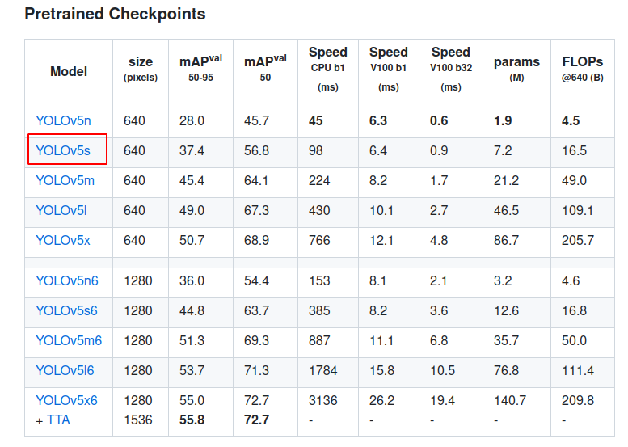
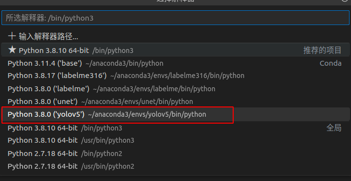
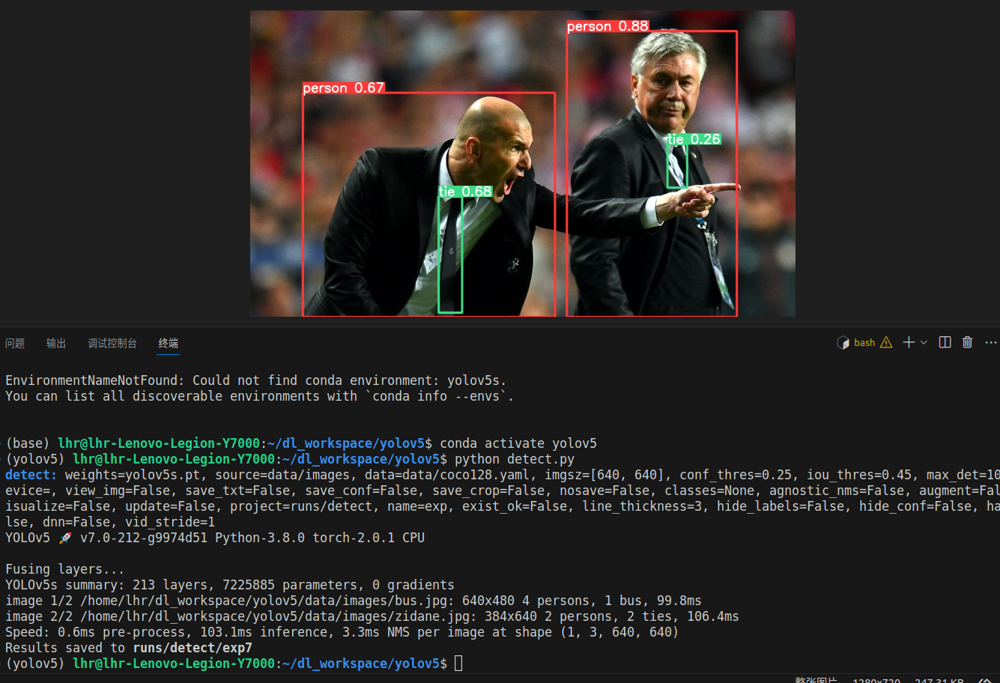

**1. 安装Anaconda3**
```
下载链接：[Anaconda3下载链接](https://www.anaconda.com/download)
```

**2. 创建虚拟环境**     

```
i.conda create -n yolov5 python=3.8   

ii.conda activate yolov5
```
   
**3. 下载yolov5**  

```  
i.项目地址：https://github.com/ultralytics/yolov5

ii.pip install -U -r requirements.txt -i https://pypi.tuna.tsinghua.edu.cn/simple（安装依赖包）

iii.服务器还没有配置好，下载训练好的模型进行测试

```  

**4. 运行**   

```  
i.VSCode选择编译器，Ctrl + shift + p，收入>，选择对应环境的解释器   
   
ii.打开终端     
iii.python detect.py     
      
```  
        
