#### Kalman Filter
参考文档：[文档链接](https://www.kalmanfilter.net/default.aspx)  
参考食品：[视频连接](https://www.bilibili.com/video/BV1PT411b7e9/?spm_id_from=333.999.0.0)       
**几种变式：卡尔曼滤波 扩展卡尔曼滤波 无迹卡尔曼滤波**  

**高斯分布（正态分布）均值 协方差矩阵**   

算法分为两步：**状态预测** 和 **状态更新**

### 1 关于Kalman Filter  

跟踪和控制系统的最大挑战之一是在存在不确定性的情况下提供对隐藏状态的准确估计，例如，GPS 接收器会受到外部因素影响的测量不确定性，例如热噪声、大气效应、卫星位置的微小变化、接收器时钟精度等。

卡尔曼滤波器是一种广泛使用的估计算法，在许多领域发挥着关键作用。 它旨在估计系统的隐藏状态，即使测量不精确且不确定。 此外，卡尔曼滤波器根据过去的估计来预测未来的系统状态。

该滤波器以Rudolf E.Kálmán（1930年5月19日 - 2016年7月2日）的名字命名。1960年，Kálmán发表了他的著名论文，描述了离散数据线性滤波问题的递归解决方案。

### 2 背景知识
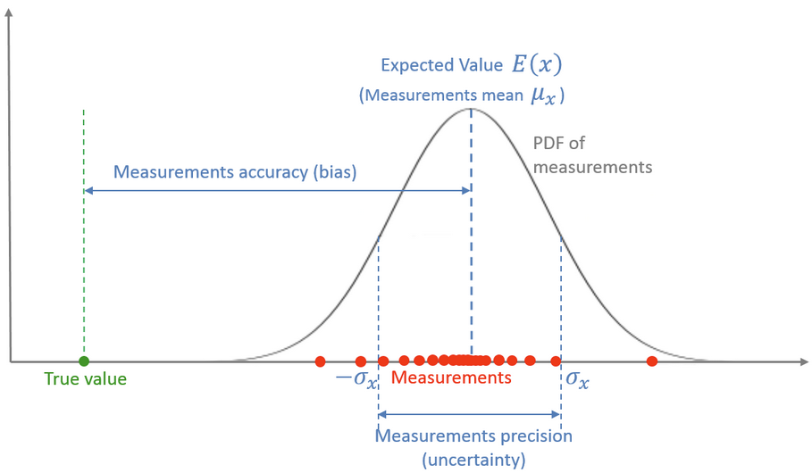
 一次测量是对一个随机变量的取样，该随机变量由一个 **概率密度函数(PDF)** 来描述。

多次测量的平均值就是该随机变量的 **期望**。

均值和真值之间的差是该测量系统的 **偏差** 或者 **系统性误差**，它构成了测量系统的 **准度**。

测量值的散布程度是该测量系统的 **测量噪声**，又叫 **随机测量误差** 或 **测量不确定性**，它构成了测量系统的 **精度**。 

### 3 α−β−γ滤波器
#### 示例1-给金条称重(状态不随时间变化)

1. 状态更新方程    

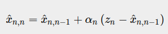 

(zn−x^n,n−1) 这一项被称为“测量残差”，也叫 **更新量**，更新量包含新的信息。

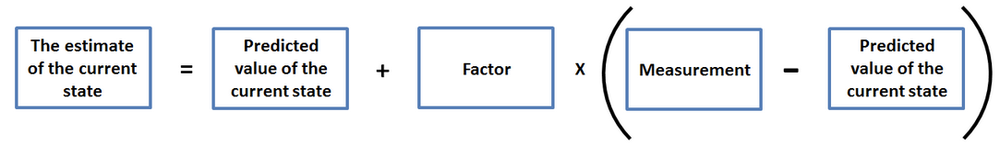  

2. 本例估计算法 

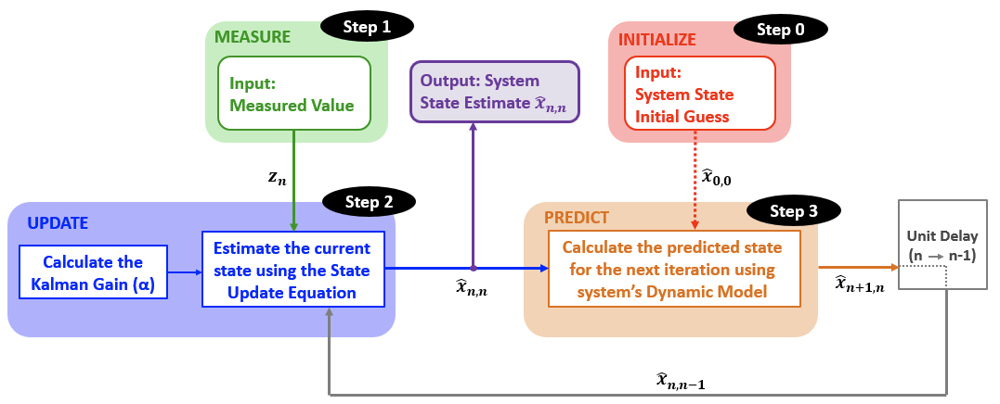  

3. 结果分析

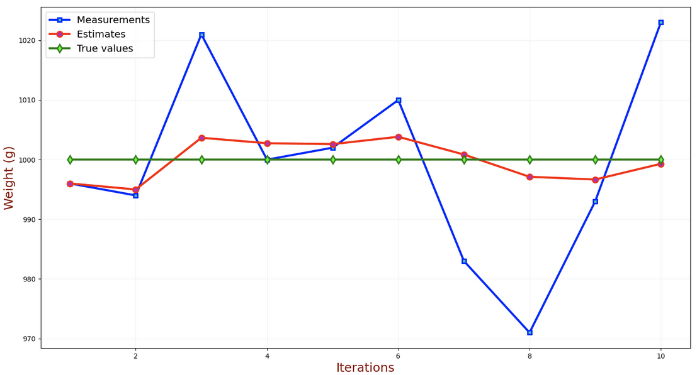

#### 示例2-跟踪直线匀速运动的飞行器（状态随时间变化）

1. α−β 跟踪更新方程 或 α−β 跟踪滤波方程   
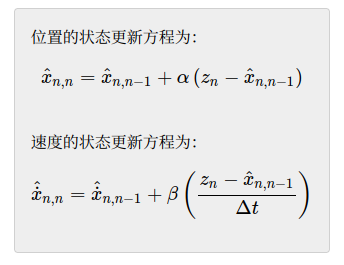

2. 估计算法   
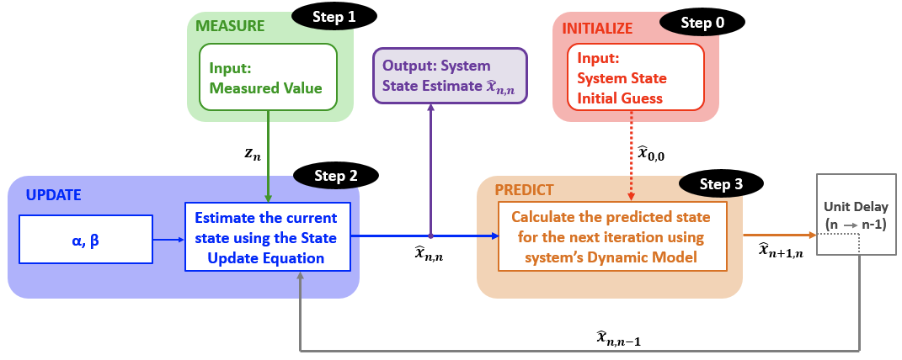

3. 结果分析  

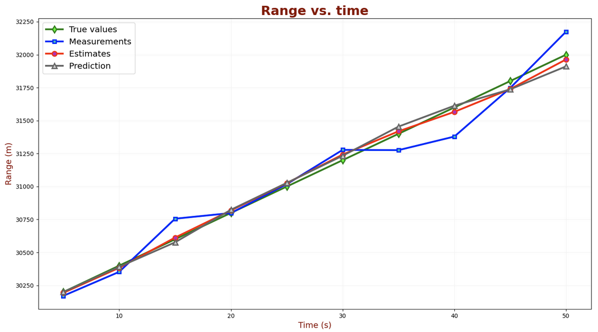

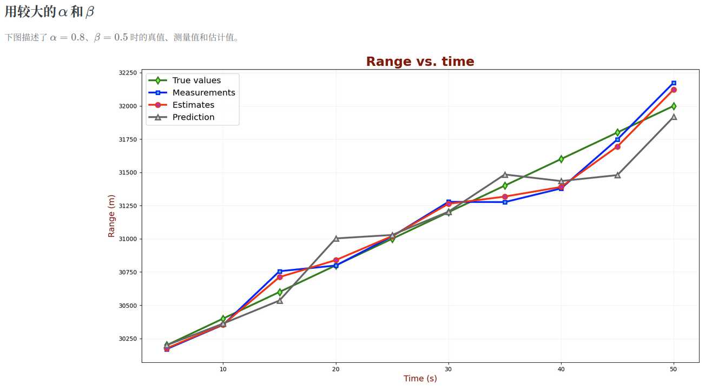

α 和 β 的值应该依测量精度而定。如果测量设备精度很高，例如激光雷达，较高的 α 和 β 会比较好，会更信赖测量值，对于本例则滤波器对飞行器速度的变化响应更快；如果测量设备精度很低，应该用较低的 α 和 β，会更信赖预测值，对于本例则滤波器对测量不确定性（误差）的平滑效果会更好，但滤波器对飞行器速度的变化响应就会慢得多。   

### 4 一维卡尔曼滤波

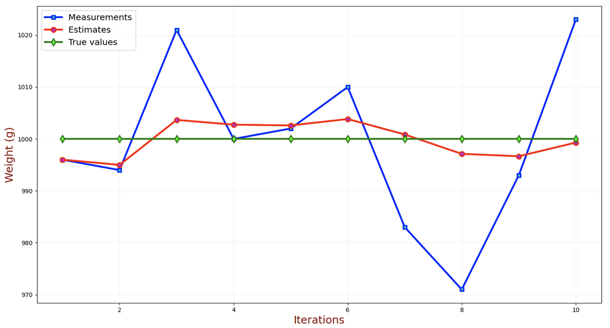

**对随机变量进行估计**
估计值（红线）和真值（绿线）之间的差就是 **估计误差**。可见，随着测量次数的增加，估计误差不断下降，并最终收敛到0，同时估计值收敛到真值。实际中我们无法知道估计误差，但是我们可以计算 **估计值的不确定性**。   
**对随机变量进行测量**
测量误差是测量值（蓝线）和真值（绿线）之间的差。由于测量误差是随机的，我们可以用方差 σ2 来描述。对应的标准差 (σ) 就是 **测量不确定性**。 

### 卡尔曼滤波器推导
1. 黄金五式
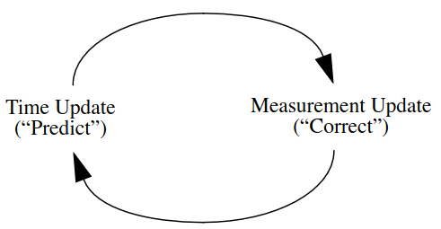
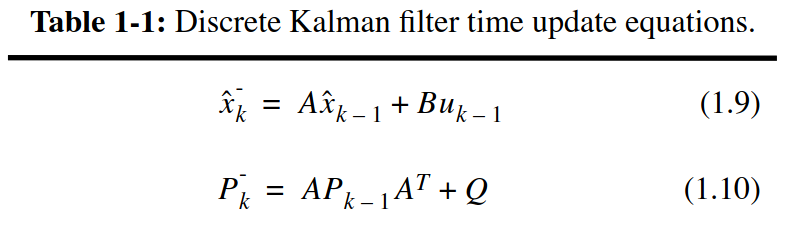
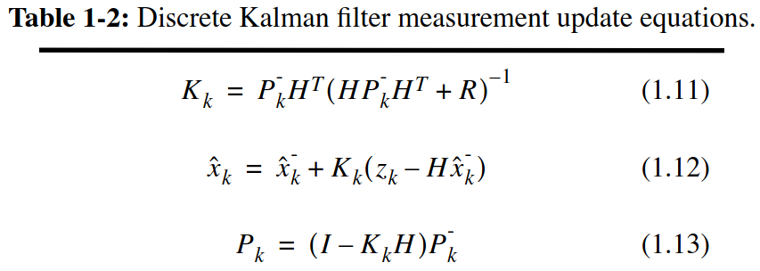
**过程：**  
预测：  
1）先验位置预测  
2）先验协方差矩阵预测      
更新：   
1）计算卡尔曼增益   
2）更新后验位置     
3）更新协方差矩阵   

A：状态转移模型
B：控制输入模型
H：观测模型
Q（process noise covariance）：过程激励噪声协方差（系统过程的协方差，状态转移矩阵与世纪过程之间的误差）
R（measurement noise covariance）：测量噪声协方差
2. 误差分布
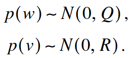

#### 参考文档
参考文档：  
[文档链接](https://www.kalmanfilter.net/default.aspx)    
[PDF参考](https://www.cs.unc.edu/~welch/media/pdf/kalman_intro.pdf)
