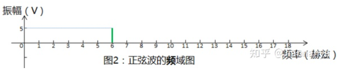

# 时域 频域 空间域
## 时域
自变量是时间，即横轴是时间，纵轴是信号的变化，其动态信号x(t)是描述信号在不同时刻取值的函数。

## 频域
自变量是频率,即横轴是频率,纵轴是该频率信号的幅度,也就是通常说的频谱图。  

## 空间域   
空间域又被称为图像空间（image space），在图像空间以长度（距离）为自变量直接对像元值进行处理称为空间域处理   

# 傅里叶变换  
### 简介  
一种线性积分变换，用于函数（简称“信号”）在时域和频域之间的变换  
**举例：** 将复杂信号分解成不同振幅的单一频率分量，并以此实现滤波等操作  
傅里叶变换：信号从时域变换到频域  
傅里叶逆变换是将信号从频域变换到时域  
   
# 卷积神经网络
## 简介  
图像本身包含丰富的结构，CNN是机器学习利用自然图像一些已知结构的创造性方法   
例子：“沃尔多扫描器”扫描图像，该检测器将图像分割成多个区域，为每个区域包含沃尔多的可能性打分   
## 卷积核（kernel）        
卷积神经网络中卷积核的高度和宽度通常为奇数，例如1、3、5或7。 选择奇数的好处是，保持空间维度的同时，我们可以在顶部和底部填充相同数量的行，在左侧和右侧填充相同数量的列。   
此外，使用奇数的核大小和填充大小也提供了书写上的便利。对于任何二维张量X，当满足： 1. 卷积核的大小是奇数； 2. 所有边的填充行数和列数相同； 3. 输出与输入具有相同高度和宽度 则可以得出：输出Y[i, j]是通过以输入X[i, j]为中心，与卷积核进行互相关计算得到的

卷积两个被训练的参数：卷积核权重（Weight）、标量偏置（bias）   

**卷积输出大小：**   

## 名词记录
- 卷积：滤波，混合信息的手段
- 卷积核：滤波器
- input image，Convolution Kernel，Feature map

## 填充（Padding）和步幅（Stride）（影响输出大小）
Padding Motivation：多层卷积会导致丢失边缘信息   
Stride Motivation：步幅越大，输出越小，可以大幅降低图像宽度和高度  
h：垂直方向  w：水平方向     

 

## CNN中Channels的理解  
（1）最初输入的图片样本的 channels ，取决于图片类型，比如RGB_3或者灰度图_1    
（2）卷积操作完成后输出的 out_channels ，取决于卷积核的数量。此时的 out_channels 也会作为下一次卷积时的卷积核的 in_channels    
（3）卷积核中的 in_channels ，刚刚2中已经说了，就是上一次卷积的 out_channels ，如果是第一次做卷积，就是1中样本图片的 channels   

## 池化（汇聚层，Pooling）  
双重目的：降低卷积层对位置的敏感性，同时降低对空间降采样表示的敏感性   
汇聚层也可以改变输出形状  
**最大汇聚层和平均汇聚层**   

# Transposed Convolution 转置卷积（Upsampling）
核心：转置卷积就是卷积   

## 上采样参数 align_corners
true：角点对齐，角点之间距离间隔相等  
false：无论是true还是false对中间的像素插值没有影响，false会对边角不太友好    
align_corners (bool, optional) – 如果为True，输入的角像素将与输出张量对齐，因此将保存下来这些像素的值。仅当使用的算法为'linear', 'bilinear'or 'trilinear'时可以使用。默认设置为False   

### 总结 
对于给定输入元素，最大汇聚层会输出该窗口内的最大值，平均汇聚层会输出该窗口内的平均值。  

汇聚层的主要优点之一是减轻卷积层对位置的过度敏感。  

我们可以指定汇聚层的填充和步幅。  

使用最大汇聚层以及大于1的步幅，可减少空间维度（如高度和宽度）。  

汇聚层的输出通道数与输入通道数相同。  

