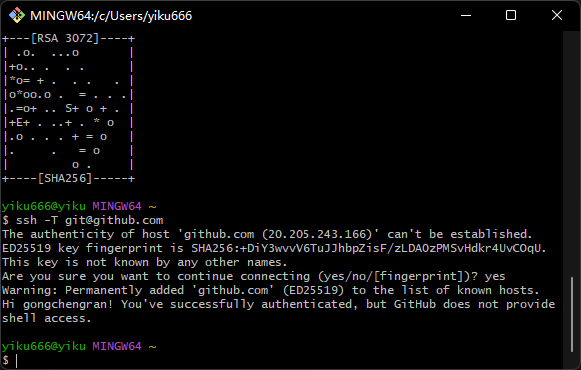
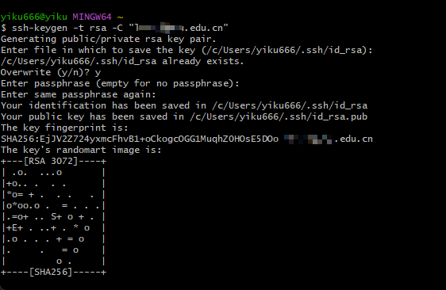
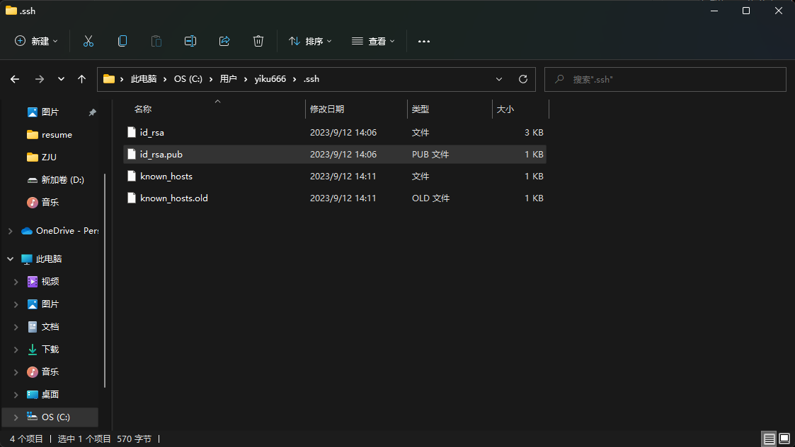
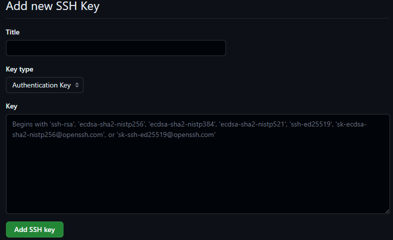
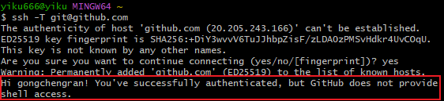
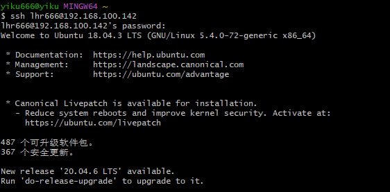

# Windows下ssh keys配置过程和连接服务器过程    
### 1 安装git bash    
安装链接：https://www.git-scm.com/download/win   
### 2 打开git bash界面     
     
### 3 配置全局git用户名称和邮箱    

```
git config --global user.name "your name"  
git config --global user.email "your email"   
```
### 4 配置ssh key    
    
``` 
ssh-keygen -t rsa -C "your email"   
```  
### 5 进入.ssh文件夹目录   
默认目录：C:\Users\yiku666\.ssh   
  
### 6 配置ssh keys     
点击github右上角头像，打开settings，找到SSH and GPG keys，点击New SSH key，将id_rsa.pub文件中的内容复制到key中    
  
### 7 打开git bash连接测试  
  
```
ssh -T git@github.com
```

# SSH连接远端服务器   
### 1 打开git bash界面   
  
```
ssh username@ip  
```
## 2 远程安装Anaconda  
```
wget https://repo.anaconda.com/archive/Anaconda3-2023.07-2-Linux-x86_64.sh     

chmod u+x Anaconda3-2023.07-2-Linux-x86_64.sh    

bash Anaconda3-2023.07-2-Linux-x86_64.sh  

exit并重新连接服务器

conda --version 即可查看是否安装成功
```
