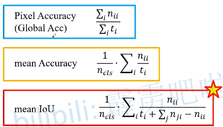
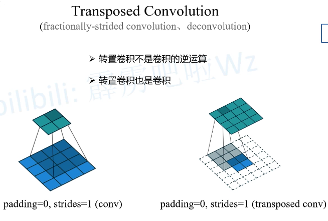
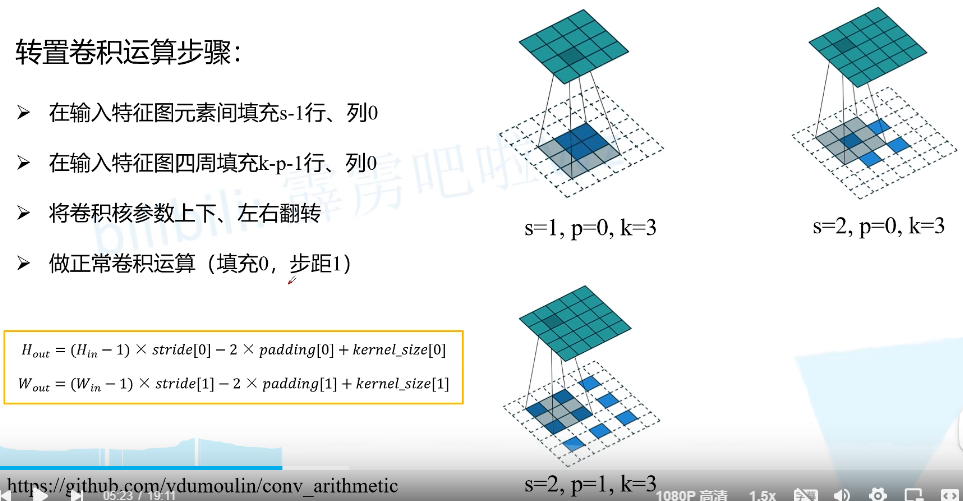
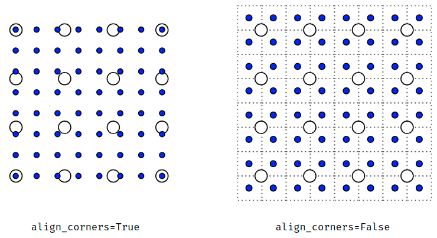

# 分割任务  
语义分割（对每个像素进行分类）   
实例分割   
全景分割    

# Datasets
PASCAL VOC：PNG图片（P模式）注意边缘及忽略的像素，单通道图像加上调色板，每个像素数值对应的索引（方便可视化预测结果）

MS COCO：针对每一个目标记录了多边形坐标  

# 常见语义分割评价指标  

# 语义分割常用工具  
Labelme：传统方式，人工标点   
EISeg（Paddle仓库下的）：半自动标注工具，存在一些训练好的模型，包含大量常见目标    

# Transposed Convolution 转置卷积（Upsampling）
核心：转置卷积就是卷积   

# CNN中Channels的理解  
（1）最初输入的图片样本的 channels ，取决于图片类型，比如RGB_3或者灰度图_1    
（2）卷积操作完成后输出的 out_channels ，取决于卷积核的数量。此时的 out_channels 也会作为下一次卷积时的卷积核的 in_channels    
（3）卷积核中的 in_channels ，刚刚2中已经说了，就是上一次卷积的 out_channels ，如果是第一次做卷积，就是1中样本图片的 channels   

# 上采样align_corners
true：角点对齐，角点之间距离间隔相等  
false：无论是true还是false对中间的像素插值没有影响，false会对边角不太友好    
align_corners (bool, optional) – 如果为True，输入的角像素将与输出张量对齐，因此将保存下来这些像素的值。仅当使用的算法为'linear', 'bilinear'or 'trilinear'时可以使用。默认设置为False   

