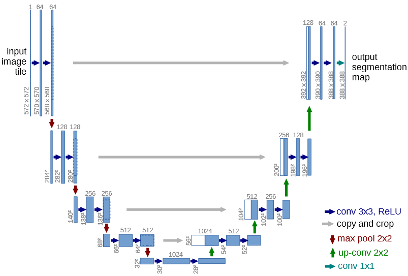
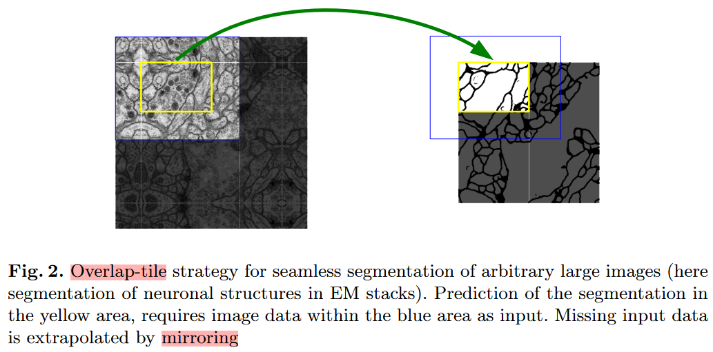
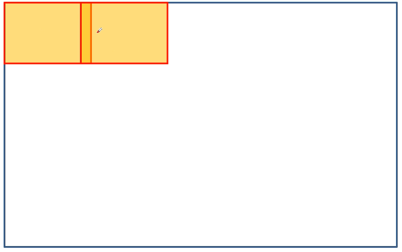
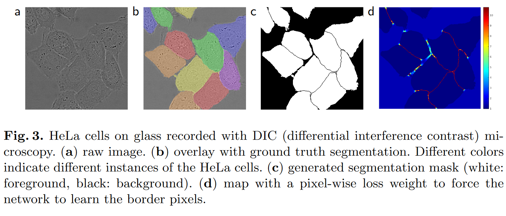

### 《U-Net: Convolutional Networks for Biomedical Image Segmentation》(CVPR 2015)

开源代码地址：   
https://github.com/WZMIAOMIAO/deep-learning-for-image-processing/tree/master/pytorch_segmentation/unet        
https://github.com/milesial/Pytorch-UNet#training（Kaggle's Carvana Image Masking Challenge）  

# Motivation
已经实现的深度网络需要大量得训练数据，而对于生物医学样本收集较为困难，文章提出了一种端到端基于少量训练数据的网络，并在分割挑战赛中取得了极好的成绩

# Network Arichitecture   

Encoder-Decoder结构  
左侧：contracting path，右侧：expasive path  

# Experiments

输入图像大小是蓝色框大小，实际分割图像是黄色区域，对于边缘区域缺失数据的情况时，文章采用镜像操作进行填充

对于高分辨率图像整个放入网络中可能会导致显存爆炸问题，可以进行overlaping操作，即从图像左上角开始，每次移动一个像素，将图像分割成若干小块，将分割的小块送入网络，最后将分割结果进行拼接   
相邻区域加一个overlap（重叠区域）    

分割结果只需要两类，一个是前景，一个是背景，前景是白色，背景是黑色  
对于细胞之间分割存在的困难，作者对于细胞和细胞之间的区域施加一个更大的损失权重，后面对应着一个热力图（1~10），细胞和细胞之间权重较大，背景则较小，但文章没有给出对比实验结果   

# Conclusion  
Unet通过Encoder-Decoder结构通过拼接的方式实现特征融合，虽然本身用于生物医学影响分析，由于它出色的性能也用于许多其他领域，例如华为20年IROS论文AVP-SLAM就用到了Unet对地库IPM图进行语义分割进行局部建图和定位        
由于文章是15年提出的，对于分辨率不同还需要copy and crop，现在复现加入padding操作保证了图片卷积后尺寸一致，同时部分还加入了Batch Normalization的操作   
