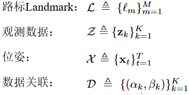
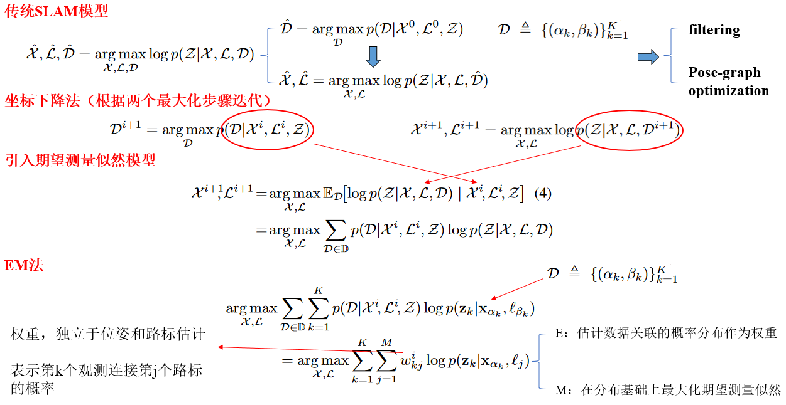
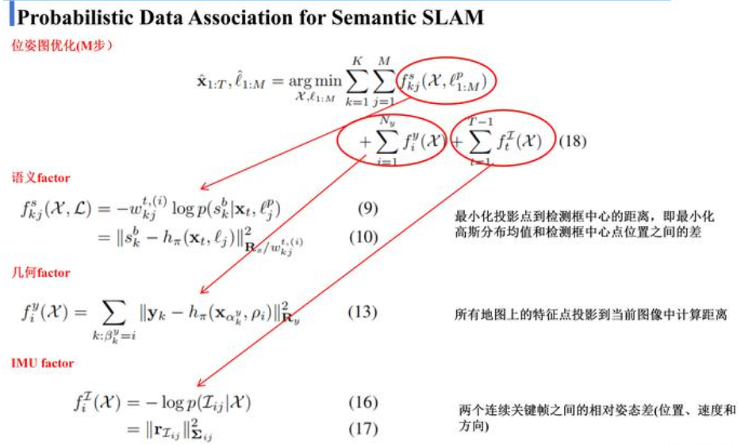

### 《Probabilistic Data Association for Semantic SLAM》（ICRA 2017 Best Paper）

参考讲解：https://zhuanlan.zhihu.com/p/499244564  

## 简介  
语义SLAM开山之作，首次将传统观测和语义信息融合到一个优化框架中，根据EM（期望最大化算法）求解，实现了更高精度的SLAM系统  

属于**Semantic SLAM**范畴，利用语义信息辅助SLAM系统     

## 文章解决问题
1. 传统SLAM较为依赖低级几何特征如点、线、面，无法为环境中的路标施加路标信息
2. 回环检测基于低级特征导致其在模糊或重复环境下容易失效
3. 目标识别能够推断路标种类和尺度，能够解决上述回环检测问题，然而传统SLAM是对度量信息的连续优化，而数据关联和识别是一类离散问题，需要使用离散推理

基于上述问题，文章提出了一个模型，融合了尺度信息、语义信息和数据关联，将其分为两个相互关联的问题如下：
1. 离散数据关联和地标类别概率的估计
2. 度量状态的连续优化

估计的地标和机器人姿态影响关联和类别分布，进而影响机器人-地标姿态优化。 我们的算法的性能在室内和室外数据集上得到了证明。

## 符号约定

## SLAM中的概率数据关联

所有的变量中，除去待优化的变量，观测可以通过几何结构提取方法和目标检测方法获得，只有关联关系是无法显式获得的，也就是是关联关系是一个隐变量，于是作者想到用EM方法进行求解整个带隐变量的优化问题，他引入期望测量的似然模型，最后通过一系列变换得到最后这个公式，他将这种硬性的数据关联，即观测就是和某个路标对应，转成了考虑每一个观测和每一个路标之间都有可能对应，这个对应关系的可信度用一个**权重因子w**来表示，EM算法的E步骤就是求解数据关联的概率分布，也就是这个权重因子   

M步骤是做一个位姿图优化，即把所有的语义factor、几何factor和IMU factor联合起来一起构成一个要优化的目标函数，在这个分布基础上最大化期望测量似然，其中语义factor的误差函数的几何意义是最小化投影点到检测框中心的距离，即最小化高斯分布均值和检测框中心点位置之间的差，几何factor是将所有地图上的特征点投影到当前图像中计算距离差，imu factor是计算两个连续关键帧之间的相对姿态差(位置、速度和方向)。

## 总结 
到此这篇论文就讲解完了这篇论文说到底就是解决了   
1、语义特征的数据关联问题
2、如何将语义特征融入优化去获得路标和摄像头姿态，这也是语义slam最核心的两个问题      

## 可以借鉴的地方   
将强硬数据关联变成软数据关联，转换为可信度权重因子w，通过EM算法求解   

## 可能改进的地方
思想   
代码方面无开源，略  

