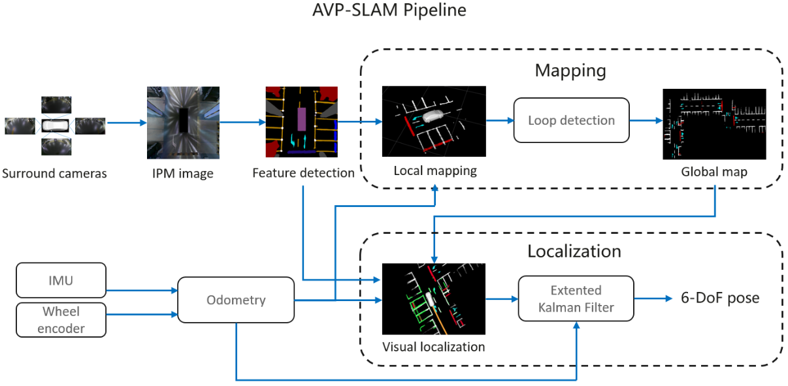

### 《AVP-SLAM: Semantic Visual Mapping and Localization for Autonomous Vehicles in the Parking Lot》(IROS 2020)  

仿真复现地址：https://github.com/liuguitao/AVP-SLAM-PLUS/tree/main  

# 简介  
自主泊车环视视觉SLAM系统    

# 要解决的问题（地库Autonomous Vehicles Parking）  
1. 狭窄、拥挤、缺乏GPS信号    
2. 缺乏纹理信息、重复结构、外观改变   

# Pipeline  

## IPM：Inverse Projection Map  

配备四个fisher lens分别在front，back, left, right，外参内参离线标定完成   

首先根据投影模型将相机拍摄图像投影到车体坐标系下  

   

再根据IPM内参将车体坐标系下的坐标投影到合成图中的像素坐标，生成IMP image   

   

合成图包含全向信息，在狭窄且容易发生遮挡的地方十分重要    

## Feature Detection
网络架构：Unet   

## Local Mapping 
通过内参矩阵将有用的分割特征投影到三维空间车体坐标系下   

基于里程计计算的位姿，将车体坐标系下坐标变换到世界坐标系下即生成局部地图，每30m（轮速计统计？）保存局部地图   

  

## Loop Detection  
用最新的local map和过往保存的local map进行 map-to-map的ICP配准，较为成功匹配则认为发生了Loop  
通过两个map的到relative pose，用于全局位姿图优化修正漂移，修正地图overlap问题   

## Global Optimization
一个全局位姿图优化，用于消除漂移并保持整个地图的一致性  
节点是每个局部地图的位姿，包含R和t，两条边分别是里程计edge，另一个是loop closure edge  
  

## Localization
通过之前建立的地图，车辆再次来到地库即可进行定位    
相似的步骤进行IPM合成图像，语义分割得到特征，通过ICP将当前特征和地图匹配进行定位  
   

ICP过程极大的依赖于初值，文中有两个策略  
1. 在地库入口处进行标记，因此车辆在入口处会被初始化得到一个位姿   
2. 在进入地库之前用GPS作为一个初始位姿    

对于一些强无纹理区域，使用EKF用Odometry信息作为预测，visual localization results作为更新，增加轨迹的鲁棒性和平滑性   

## Parking Spot Detection  
通过IMP图特征的parking lines和parking corners确定停车区域   

# Experiments  

较高的召回率保持  

较低的内存占用（经过八叉树压缩后的结果）  

centimeter-level 定位精度  

  

# 与经典的方法有什么改进的地方  

1. 加入了语义信息作为辅助，克服了地库场景的困难  
2. ICP初值的获取   

# 改进的地方 
1. 感觉语义信息使用的较为合理，但还是有种脱离整个SLAM系统的感觉，参考Probabilistic SLAM  

