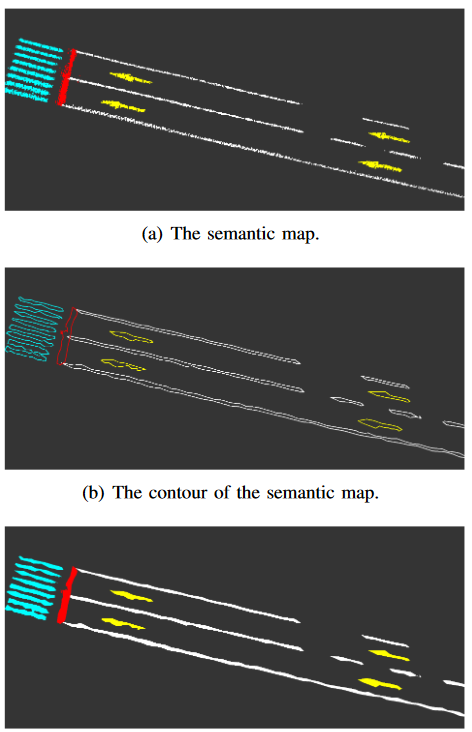

### 《RoadMap: A Light-Weight Semantic Map for Visual Localization towards Autonomous Driving》(ICRA 2021)  

参考秦通知乎文章：https://zhuanlan.zhihu.com/p/382183817  

视频：https://www.zhihu.com/zvideo/1389638431253868544

# 1 简介 

不用高精地图行不行？RoadMap：自动驾驶轻量化视觉众包地图  

# 2 要解决的问题

高精地图的限制：  

1. 制作成本高，需要专业人员  
2. 漫长的制作周期  
3. 实际场景常发生更新  

长期以来（long term）基于传统外观方法（传统VSLAM）的问题：  
1. 光照变化（light）  
2. 视角变化（perspective）  
3. 时间变化（time changes）  

思路：  

1. 随着AD的发展，量产车配备的传感器等设备越来越丰富，本文中涉及相机、IMU、轮速、RTK GNSS和4G、5G通信模块等   
2. 云端存储   

### GPS RTK GNSS

GPS：全球定位系统(Global Positioning System)，一种以人造地球卫星为基础的高精度无线电导航的定位系统  

RTK：实时差分(Real-Time Kinematic)，基于GNSS的实时差分定位系统

GNSS:全球导航卫星系统（Global Navigation Satellite System）

GPS 是多个正在运行的全球导航卫星系统 (GNSS) 之一，包括俄罗斯的格洛纳斯 (GLONASS)、欧洲的伽利略 (Galileo) 和中国的北斗 (BeiDou)  

实时运动定位 (RTK) 是一种测量应用，用于纠正当前卫星导航 (GNSS) 系统中的常见错误     

# 3 Structure 

camera-only method：  
1. PTAM  
2. SVO  
3. Lsd-slam  
4. Orb-slam2  

visual-inertial：  
1. MSKF  
2. Vins-mono  
3. Keyframe-based   
4. On-manifold preintegration

## ON-VEHICLE MAPPING  
1. Image Segmentation  
CNN-based，对front-view image进行分割   
  

2. Inverse Perspective Transformation  
在车体坐标系下将semantic pixels通过IPM从图像平面映射到地面（ground plane），相机内参外参通过离线标定完成   
由于存在透视误差，场景越远越大误差，通过划定ROI（Region of Interest）区域解决，大小为车前12m×8m长方形   
假设地面水平，在车体坐标系下根据外参内参将像素投影到地平面（z = 0）   

3. Pose Graph Optimization  
RTK-GNSS能提供厘米级别精度定位，但在信号不好区域（如大楼遮挡）需要odometry   
里程计存在累计漂移，通过位姿图优化进行修正，node是车辆状态即位姿（position and orientation），edge是GNSS constraint 和 odom constraint   
  

4. Local Mapping  
通过optimized pose将车体坐标系下的坐标转换到世界坐标系下，由于分割噪声，分割结果可能不准确，方法为将地图分为多个栅格grid，分辨率为0.1×0.1×0.1m，计算每个grid的分数（counts）     

## ON-CLOUD MAPPING
1. Map Merging / Updating  
云端上同样分割为grid，同样每个grid需要进行分数  

2. Map Compression  
根据轮廓（contour）进行压缩   

## USER-END LOCALIZATION
1. Map Decompression  
用户下载到地图需要解压（decompression），通过contour points实现，从下图中看到解压缩效果较好    

2. ICP Localization  

## EXPERIMENTAL RESULTS  
1. Map Production  
平均压缩的语义地图 **36KB/KM**  

2. Localization Accuracy  
文中提出的方法和lidar-based进行对比，vision的精度更好   

# 4 与经典的方法有什么区别（值得学习的思路）     
1. 加入 Cloud Server   
2. 图像通过contour points进行压缩和恢复的思路  
3. 划分为grid并进行打分   
4. 图像划分ROI区域      

# 5 改进思路  
目前没有，看着较AVP-SLAM整体思路较为类似       
