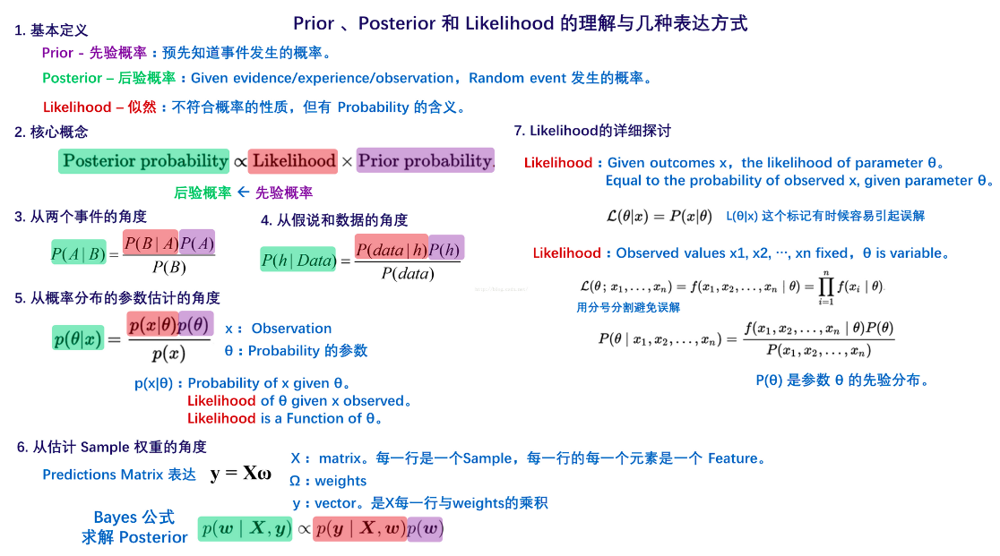
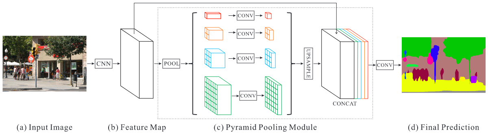
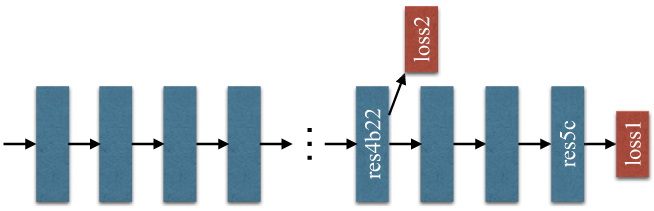
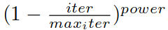
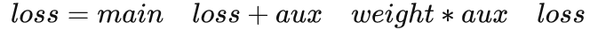
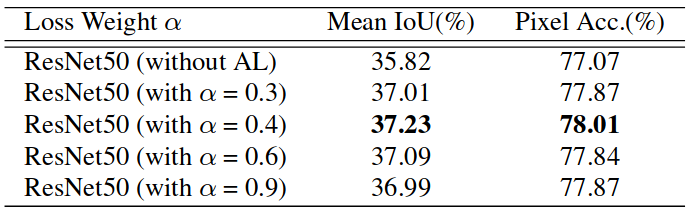

### 《Pyramid Scene Parsing Network》（CVPR 2017）  

# 0 notes
1. category labels和imagelevel scene descriptors的区分
>The new ADE20K dataset [43] contains 150 stuff/object category labels (e.g., wall, sky, and tree) and 1,038 imagelevel scene descriptors (e.g., airport terminal, bedroom, and street).  

2. prior的定义

3. receptive field  
convNets(cnn)每一层输出的特征图(feature map)上的像素点在原始图像上映射的区域大小  
用于帮忙设计网络结构，大致了解每一层特征所涵盖的信息   

# 1 主要贡献
提出的金字塔池化模块(Pyramid Pooling Module)能够有效聚合不同区域的上下文信息，提高获取全局信息的能力，实验证明这样的先验信息能够有效提升语义分割的效果  

# 2 文章要解决的问题
1. Mismatched Relationship  
上下文信息是普遍且重要的，尤其对于复杂场景分析来说  
例子中FCN根据外观将框中的船预测为“汽车”，而汽车是很少过河的，这就是缺乏上下文信息导致的误匹配  
2. Confusion Categories  
数据集中许多类标签在分割时令人困惑，例如山和丘陵，墙壁、房屋、建筑物和摩天大楼，相似的外貌会导致一定的像素误差   
例如FCN将框中的对象一部分预测为摩天大楼，一部分预测为建筑物，应排除这些物体，整个对象要么是摩天大楼要么是建筑物   
通过类别之间的关系可以解决  
3. Inconspicuous Classes  
场景中包含任意大小的对象，某些小东西例如路灯、招牌可能很重要但难以找到，相反某些大物体可能会超过FCN的感受野而导致预测不连续，总结即许多错误部分或完全与不同感受野导致的上下文关系和全局信息相关，因此具有一个合适全局场景级的先验十分重要   

# 3 网络
1. Pyramid Pooling Module  
深度学习中感受野粗略表明利用上下文信息能力的程度，在一些深层网络结构如ResNet中感受野已超过图像本身，但相关研究表明其实CNN的实际感受野要小于理论值，尤其是高层信息上，因此作者提出了一种有效的全局先验信息表示的方法    
全局池化作为全局信息先验是一个很好的基线模型，常用于图像分类任务，然而对于ADE20K中的复杂场景，该策略不足以覆盖所有的必要信息，像素会被标记，直接将他们融合成一个向量会损失空间关系并造成歧义。一个基于子区域的全局上下文信息表示对区分类别是有益的。更进一步，要是能够不同子区域的感受野能效果就会更好     
  
在Spatial pyramid pooling一文中，金字塔池化生成的不同级别的特征图被展平并连接到FCN中用于分类。这种先验信息目的是消除CNN中固定尺寸的约束，为进一步减小不同区域间上下文信息的丢失，作者提出了一种分层的全局先验信息Pyramid pooling module，包含不同尺度和不同子区域间变化的信息，用于深度神经网络最终层feature map上进行全局场景先验信息的构造  
文中pyramid pooling module融合了四个比例的特征，最粗糙的是1*1全局尺度的池化，剩下的层次将图像分为不同的子区域，形成不同区域的信息表示，金字塔池模块中不同level的输出包含比例不同的feature map（比如输入的维度都是 ，有四个层次的金字塔，那么输出的维度则为 ）。为了保持全局特征的权重，若如果金字塔的数量为 ，则在每个金字塔级别之后使用 卷积层将上下文表示的维度减小到原先的 。然后直接对feature map进行双线性插值，恢复到输入的长宽上。最后，将不同level的特征拼接起来作为金字塔池化的全局特征。  
金字塔每个级别的数量及大小根据feature map大小可以修改，结构通过采用不同大小的池化层提取不同的子区域   
2. 网络架构
架构如上图，特征提取网络采用带空洞卷积的预训练的ResNet。最后一层的feature map尺寸为输入图像的1/8。为了说明我们的结构，PSPNet为像素级场景解析提供了有效的全局上下文先验。金字塔池模块可以收集不同尺度的信息，比全局池化更具代表性。在计算成本方面，我们的PSPNet与dilated FCN网络相比并没有增加太多。在端到端学习中，可以同时优化全局金字塔池模块和FCN模块。   

# 4 基于ResNet的FCN深度监督

深度预训练网络可带来良好的性能，然而增加网络深度可能会带来额外的优化难度。ResNet通过每个块中的跳过连接(skip connection)解决了这个问题。深度ResNet的后面几层主要是基于前面的层来学习残差。
相反，作者提出了通过额外损失的监督来生成初始结果，然后用最终的损失学习残差  
上图显示了ResNet101模型的训练示例。除了使用softmax损失来训练final分类器的主分支外（loss1），在第四阶段之后还应用了另一个分类器，即res4b22。与将反向辅助损耗阻止到几个浅层的中继反向传播不同，我们让两个损耗函数通过所有先前的层。 loss2有助于优化学习过程，而loss1决定最终分类。loss2进行了权值平衡。在测试阶段，我们放弃了loss2，并且仅将经过优化的主分支用于最终预测。这种基于ResNet的FCN的深度监督训练策略在不同的实验环境下具有广泛的用途，并且可以与预训练的ResNet模型一起使用，体现了这种学习策略的普遍性。   

# 5 实验
1. 实验数据集  
ImageNet scene parsing challenge 2016  
PASCAL VOC 2012 semantic segmentation  
urban scene understanding dataset Cityscapes  
2. 实验细节  
“Poly”学习率策略：LR = 0.01, power = 0.9，实验发现迭代次数越多效果越好，ImageNet 150K，PASCAL VOC 30K, Cityscapes 90K  
   
SGD(Stochastic Gradient Descent) with momentum：momentum = 0.9， weight decay = 0.0001   
数据增强：随机缩放 0.5～2 倍，-10～10 度的随机旋转，对ImageNet和PASCAL VOC的随机高斯模糊（上述数据增强策略为了防止网络过拟合）  
其他：模型带空洞卷积（参考文献4），batch size = 16，辅助loss的权重为0.4   
3. 辅助loss
引入的辅助损失有助于优化学习过程，同时不影响主分支中的学习。我们尝试将辅助损失权重 设置在0到1之间，结果如下图。Baseline是ResNet50-based FCN with dilated network，并使用主分支的softmax损失进行优化。添加辅助损耗分支alpha = 0.4可获得最佳性能。我们相信，随着新的增加的辅助损耗，更深层的网络将受益更多。反向传播的最终loss的计算方式: 
  
   

之后还做了许多相关对比试验，证明pspnet的性能，这里就不再赘述   

# 6 总结
1. 作者已经提出了一个有效的金字塔场景解析网络，用于复杂场景的理解。 金字塔池化功能提供了更多的上下文信息。我们还为基于ResNet的FCN网络提供了深度监督的优化策略。我们希望公开的实施细节可以帮助社区采用这些有用的策略进行场景解析和语义分割，并推进相关技术的发展    
2. 将pspnet和orb-slam2进行结合，实现稠密稠密重建功能    

