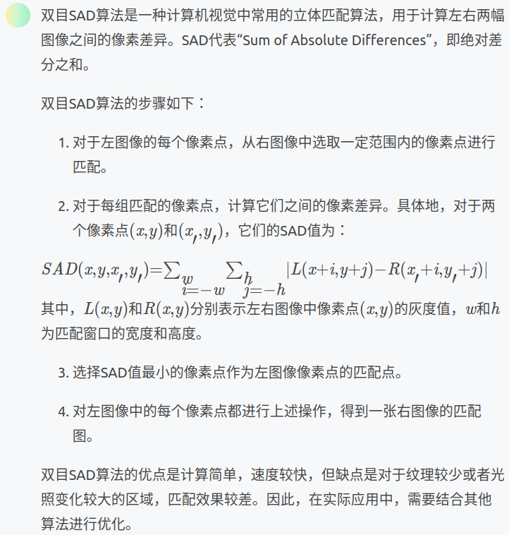
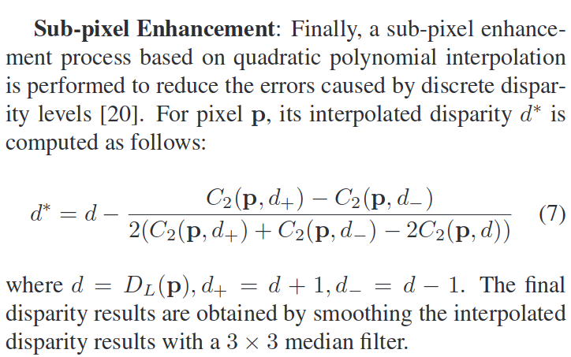

1. SAD双目匹配算法    
  

2. 等待线程结束并回收资源  
```
threadLeft.join();    
threadRight.join();
```

3. 特征点  
特征点由关键点和描述子组成，对于ORB来说即FAST+BRIEF  
BRIEF是一种二进制描述子，描述向量由许多0,1组成，这里的0和1编码了关键点附近两个随机像素（比如p和q）的大小关系，最终得到128维由0、1组成的向量   

4. KF
通常情况下MapPoint的关键帧就是创建该MapPoint的那个关键帧  

5. thread.join()  


6. 相机位姿  
通常来说相机位姿指的就是Tcw  

7. Sub-pixel Enhancement  
  
