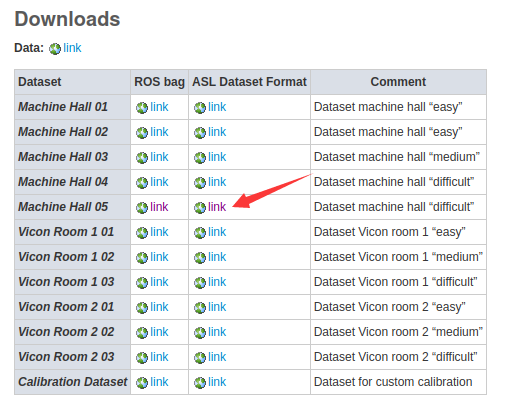
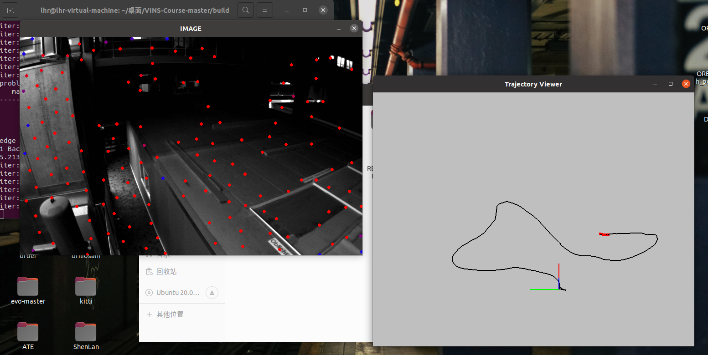

**1.下载数据集（注意要下载右边这个）** 

```
https://projects.asl.ethz.ch/datasets/doku.php?id=kmavvisualinertialdatasets
```



**2.修改数据集路径**

```
在文件src/test/run_euroc.cpp下修改为自己的路径
string sData_path = "/home/lhr/dataset/MH-05/mav0/"
```

**3.编译**

```
cd build

cmake ..

make -j4
```

**4.报错及解决**

常规报错网上可搜到不再赘述，有一个比较特殊的在此记录


**5.运行**

```
cd build
../bin/run_euroc /home/lhr/dataset/MH_05/mav0/ ../config/
```

**6.运行结果**



